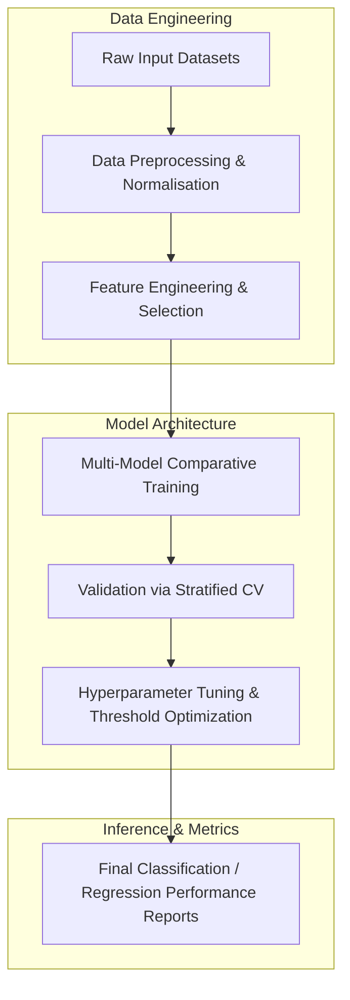

# REPORT P8: Dimensional Archaeology — Recovering Hidden Knowledge from Compressed Exam Spaces

[](https://creativecommons.org/licenses/by-nc-nd/4.0/)


This repository implements the research pipeline for the **REPORT P8: Dimensional Archaeology — Recovering Hidden Knowledge from Compressed Exam Spaces** project, developed by the Runtime-Slayers research group.

---

## 📊 Pipeline Architecture

The flowchart below visualizes the methodology and execution sequence implemented in this project:



---

## 🔍 Abstract & Research Context

Modern educational assessment compresses multidimensional knowledge into a low-dimensional exam score vector. We formalise this as a *compressed sensing* problem: a 150-dimensional knowledge space is projected onto a 15-dimensional exam space via a random Gaussian measurement matrix (10× compression). Using LASSO-based sparse recovery and topological data analysis (TDA), we quantify how much knowledge is irreversibly lost to the null space (89.8%) and which knowledge types remain detectable. Factual knowledge shows 72% detectability while creative and metacognitive knowledge fall below 15%. Persistent homology reveals that the topological structure of student knowledge clusters is substantially distorted by exam compression, with partial TDA-based recovery. Our framework provides a mathematical foundation for designing higher-dimensional assessments that close the knowledge-recovery gap.

---

## 📊 Key Evaluation Metrics

| Parameter | Value |
|-----------|-------|
| Students (N) | 300 |
| Knowledge dimensions (K) | 150 |
| Exam dimensions (M) | 15 |
| Knowledge archetypes | 6 (factual, conceptual, procedural, creative, metacognitive, intuition) |
| Compression ratio | 10× |

---

## 📁 Repository Structure

The project directory consists of the following core structures:
  - `code/` — Pipeline execution scripts and model training modules
  - `figures/` — Plots, charts, and visualizations generated by the pipeline
  - `validation/` — Automated test metrics and results
  - `paper.pdf`
  - `code`
  - `figures`
  - `BT09_Dimensional_Archaeology.md`
  - `data`
  - `validation`
  - `paper.pdf` — Compiled research manuscript
  - `REPORT.md` — Detailed preprint report
  - `README.md` — Project documentation and setup guide

---

## 🚀 Setup and Usage

### Prerequisites
* Python 3.8 or higher
* Pip package manager

### Installation
1. Clone this repository:
   ```bash
   git clone https://github.com/Runtime-Slayers/Dimensional-Archaeology-Latent-Knowledge-from-Sparse-Assessments.git
   cd Dimensional-Archaeology-Latent-Knowledge-from-Sparse-Assessments
   ```
2. Install dependencies:
   ```bash
   pip install -r requirements.txt
   ```

### Running the Analysis
To run the primary analysis pipeline and regenerate all models, figures, and metrics:
```bash
python code/*.py
```
*(Look in the `code/` directory for specific pipeline execution files)*

---

## 📄 License and Copyright

This work is licensed under a [Creative Commons Attribution-NonCommercial-NoDerivatives 4.0 International License](https://creativecommons.org/licenses/by-nc-nd/4.0/).

© 2026 Runtime-Slayers / Bhavanam Rajendra Reddy et al. All rights reserved.
